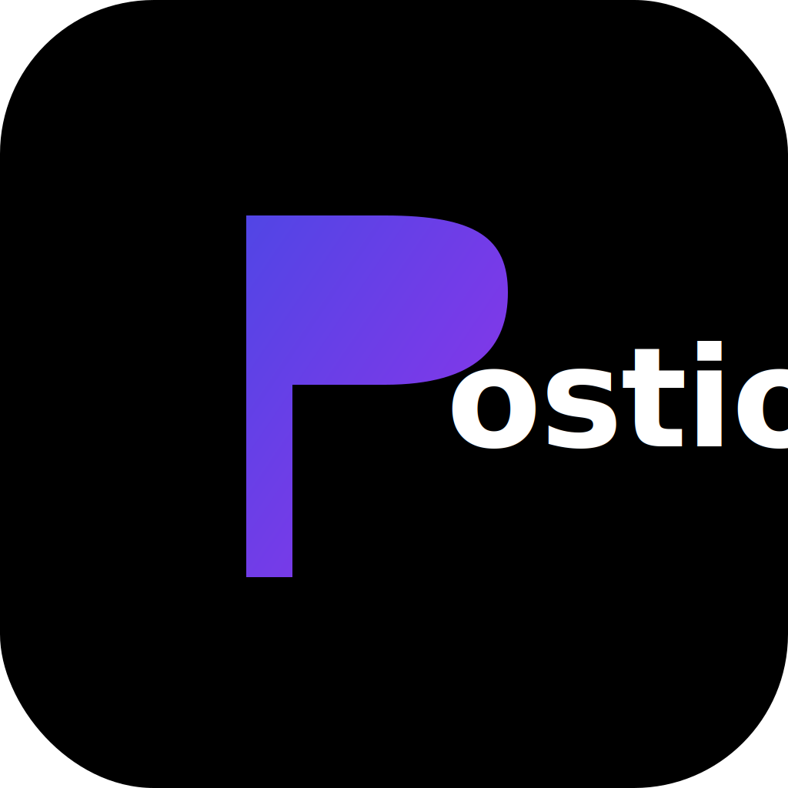
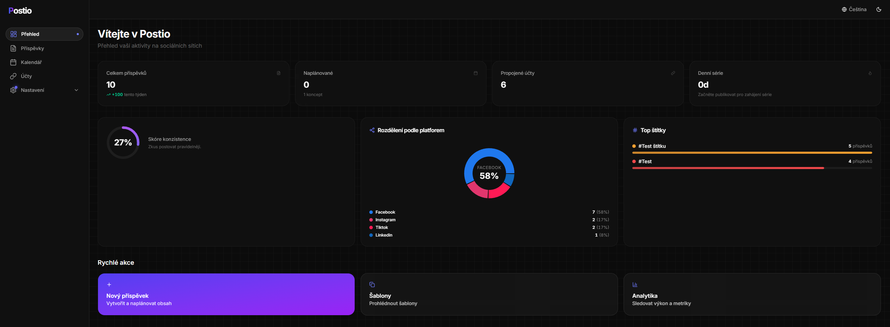

<div align="center">
  
  <h1>Postio – Social Media Planner with AI</h1>
  <p>
    🚀 <a href="https://postio-app.cz"><strong>postio-app.cz</strong></a> – Alternativa k Buffer pro tvůrce obsahu.
    Plánujte, publikujte a analyzujte své příspěvky na sociálních sítích z jednoho místa – s důrazem na jednoduchost, motivaci a produktivitu.
  </p>
  
</div>

---

## ✨ Unikátní funkce

- 🧠 **AI Vision (Gemini)** – Automaticky generujte popisky a koncepty příspěvků z obrázků
- 🌐 **Multi-platform Publishing** – Publikujte na Facebook, Instagram, LinkedIn, YouTube, X a TikTok najednou
- 📱 **High-Fidelity Previews** – Precizní náhledy toho, jak příspěvek bude vypadat na každé síti
- ⏰ **Auto-Queue** – Automatické naplánování příspěvků na optimální čas
- 📊 **Reálná Analytika** – Detailní metriky výkonu z přímo z sociálních sítí

---

## 🛠 Tech Stack

| Kategorie | Nástroje |
|---|---|
| **Framework** | [Next.js 16](https://nextjs.org) (App Router) |
| **UI & Styling** | [React 19](https://react.dev), [TypeScript](https://www.typescriptlang.org), [Tailwind CSS v4](https://tailwindcss.com) |
| **Komponenty** | [shadcn/ui](https://ui.shadcn.com), [Radix UI](https://www.radix-ui.com), [Lucide React](https://lucide.dev) |
| **Backend & DB** | [Supabase](https://supabase.com) (Auth, PostgreSQL, Storage) |
| **i18n** | [next-intl](https://next-intl-docs.vercel.app) |
| **Animace** | [Framer Motion](https://www.framer.com/motion) |
| **Grafy** | [Recharts](https://recharts.org) |
| **2FA** | [otplib](https://github.com/yeojz/otplib), [qrcode](https://github.com/soldair/node-qrcode) |

---

## 🚀 Getting Started

### 1. Klonování repozitáře

```bash
git clone https://github.com/vaclav-postio/postio.git
cd postio
```

### 2. Instalace závislostí

```bash
npm install
```

### 3. Environment variables

Zkopíruj `.env.example` do `.env.local` a vyplň hodnoty:

```bash
cp .env.example .env.local
```

| Proměnná | Popis |
|---|---|
| `NEXT_PUBLIC_SUPABASE_URL` | URL tvého Supabase projektu |
| `NEXT_PUBLIC_SUPABASE_ANON_KEY` | Veřejný anon klíč Supabase |
| `NEXT_PUBLIC_APP_URL` | URL aplikace (produkce nebo `http://localhost:3000`) |

### 4. Databázové migrace

V konzoli Supabase SQL Editor spusť všechny SQL soubory z `/supabase/migrations/` v chronologickém pořadí (001 → 038).

> ⚠️ **Důležité:** Migrace obsahují RLS politiky, triggery a seed data. Bez jejich aplikace aplikace nebude plně funkční.

### 5. Spuštění vývojového serveru

```bash
npm run dev
```

Otevři [http://localhost:3000](http://localhost:3000) v prohlížeči.

---

## 🏗️ Architektura

Projekt využívá model **Post + Platform Instances**:
- Každý příspěvek (`posts`) může být publikován na více sítích
- Každá platforma má vlastní instanci (`post_platforms`) s individuálním stavem, metadaty a externími ID
- Umožňuje atomickou správu publikace a zpracování chyb pro každou síť zvlášť

---

## 🎨 Design System

- **Styl:** Premium Glassmorphism
- **Pozadí:** Pure Black (`#000`)
- **Karty:** `#09090b` s opacitou
- **Radius:** `20px` (`rounded-[20px]`)
- **Mřížka:** `24×24px` s jemnou průhledností
- **Efekty:** Jemné glow gradienty
- **Fonty:** Geist / Inter pro texty, stylizované logo pro branding
- **Režimy:** Světlý / Tmavý / Podle systému

---

## 📱 Podporované sítě

| Síť | Publikování | Editace | Smazání |
|---|---|---|---|
| **Facebook** | ✅ | ✅ | ✅ |
| **Instagram** | ✅ | ❌ | ✅ |
| **LinkedIn** | ✅ | ❌ | ✅ |
| **YouTube** | ✅ | ✅ | ✅ |
| **X (Twitter)** | ✅ | ❌ | ✅ |
| **TikTok** | ✅ | ❌ | ❌ |

---

## 🌐 Lokalizace

Aplikace podporuje 3 jazyky:
- 🇨🇿 Čeština (výchozí)
- 🇬🇧 Angličtina
- 🇺🇦 Ukrajinština

Překlady se nacházejí v `/src/messages/`.

---

## 📁 Struktura projektu

```
postio/
├── src/
│   ├── app/
│   │   ├── [locale]/              # Lokalizované routy
│   │   │   ├── (auth)/            # Přihlašovací stránky
│   │   │   └── (dashboard)/       # Chráněné stránky
│   │   ├── api/                   # API routy
│   │   └── layout.tsx             # Root layout
│   ├── components/                # Komponenty
│   ├── lib/
│   │   ├── actions/               # Server Actions
│   │   └── supabase/              # Supabase klienti
│   └── messages/                  # Překlady
├── supabase/
│   ├── migrations/                # SQL migrace
│   └── functions/                 # Edge Functions
└── package.json
```

---

## ⚡ Užitečné příkazy

| Příkaz | Popis |
|---|---|
| `npm run dev` | Vývojový server |
| `npm run build` | Production build |
| `npm run lint` | ESLint kontrola |

---

## 📄 Licence

Tento projekt je soukromý a není určen pro veřejnou distribuci.

---

> 💡 **Pro vývojáře:** Před každou prací na projektu si přečti `CLAUDE.md` a `CHANGELOG.md`.
